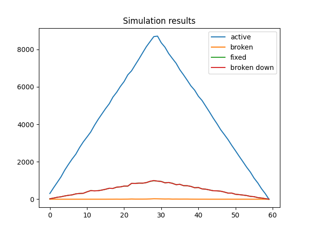
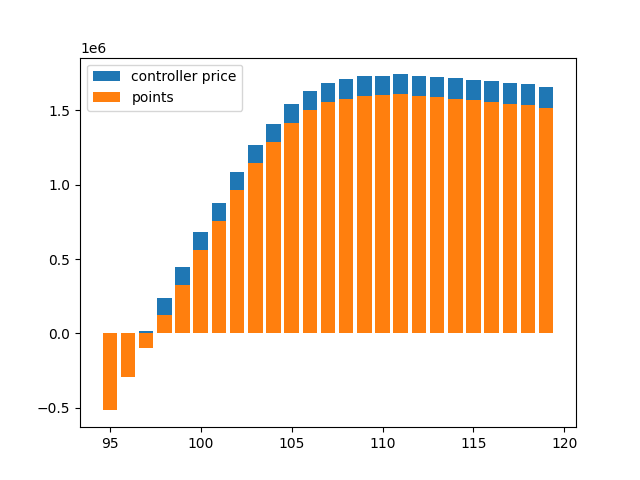

# Table of contents

1. [Task](#Task)
1. [Solution](#Solution)
1. [Results](#Results)

# Task
<details>
<summary>Full text</summary>

Your task will be to create a simulation of a fleet of robots that do some work in order to generate points over a sequence of rounds.


You are managing 10.000 robots. Each robot has a unique serial number, an activation round, a deactivation round, an active state, a health state and a task to generate points.


In the beginning of the simulation each robot will be assigned an activation round as a random number between 1 and 30, and a deactivation round as a random number between 30 and 60. When a robot reaches its activation round it becomes active; when it reaches its deactivation round, it becomes inactive.


Each active robot generates 1 point per round if healthy after performing a workload. A workload consists in generating a number between 1 and 100. If the value is below or equal to 90 the point is generated. If the value is above 90 then the robot becomes unhealthy instead. Until repaired, an active, unhealthy robot generates negative points, -10 per round.


The robots cannot fix themselves. They can only be repaired by a fleet of controllers. A controller can monitor a range of robots and repair the unhealthy ones. A robot doesn’t know about the controller but the controller knows about robots. A controller is limited to 100 robot interactions (read robot active status, read robot health status, repair robot) per round. Each round, a controller also consumes 20 points for its own effort.


The controllers’ fleet has the following characteristics:

- Controllers do not know about each other

- Controllers are not directly reachable but are managed from a command center that contains the list of serial numbers of the robots through which a certain controller can interact with a certain robot.

- The only permitted interactions for the controller are these 3: read robot active status, read robot health status, repair robot


The command center knows:

- Total number of robots, not the robot details

- List of controllers

</details>

Your mission is to generate a minimum of 50.000 points in 60 rounds.


In a language of your choice, implement a solution that simulates the scenario to generate the points. The solution includes: a description of the model, explanations for the design and algorithm choices, a runnable simulation of the 60 rounds that displays at least the final score.

# Solution

## Implementation Details

I chose python because it allows for fast prototyping, has helpful packages(random, matplotlib) and supports both OOP and functional programming.


- The controllers act after all robots have acted on a round

- Robots work during their activation rounds, but not during their deactivation round

- Robot points are awarded at the end of the round, after all controllers have acted

## Point considerations

Average robot livespan is 30 rounds, the average number of active robots is 5.000
- Average broken robots per round: 500 [-5.000 points per round]
- Best case: 600.000 (1 * 60 * 10.000) [10.000 points per round]
- Best average case: 300.000 (1 * 30 * 10.000) [5.000 points per round]
- Worst case: -3.000.000 (-10 * 30 * 10.000) [-100.000 points per round]
- Target: 50.000 [834 points per round]

Point budget: ~4.000 points per round

> Cost for 111 controllers: 2220 points per round

## [Controller] Per robot procedure

```py
if c.read_health(r) == False:
	c.fix(r)
```
- Each robot in range uses 1-2 ops. This means each controller can process between 100-50 robots per round
- The active state of robots is never checked, because of added overhead for each robot (worst case 33 robots checked vs. 50 per round).

	It may be more useful to only check health state and risk fixing inactive robots, if it means an overall increase in robot throughtput.

	Plus, since an inactive robot can't break down, this means at most one 'useless' fix per robot.

	Note: I made this decision with the aim of optimising the number of operations. If the 'fixing' operation was more costly, then both checks would be necessary.

> While running the same strategy with an added `read_active()`, it was able to generate ~50.000 points with 199 controllers

---

The robots are checked in the ascending order of their serial numbers.

> Other (unimplemented) checking methods would be a sense reversing traversal or an alternating traversal on 2-5 equal chunks of the robot range.
>
> The intuition for these other methods would be to try to counteract the fact that robots near the end are checked less. But doing this likely solves nothing, other than changing the 'disadvantaged' robots each round.
>
> The second method is additionally based around reducing the number of controllers necessary to cover all robots, but as a consequence, the problem above is more prevolent.

# Results

The final solution generates on average `161.000` points.

It uses 111 controllers with the work strategy mentioned above.
> Each controller has ~90 robots to monitor, which corresponds to the average case (90% healthy robot prob, 100 max robots processed).

Simulation results | Performance depending on controller count (average over 10 runs)
:-----------------:|:-----------------:
  | 

The simulation can export collected data about robots as a text file or display it as a graph, with configurable statistics.